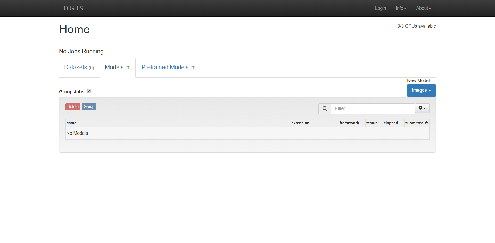

# DSRG-CAFFE-DIGITS-ENV
DSRG Caffe DIGITS Env

## How to build a environment containing CAFFE and DIGITS which can reproduce DSRG paper result **without root permission** On Ubuntu 16.04 LTS

### **Python Version 2.7.16**

### Outlines

#### Anaconda3

#### OpenBLAS

#### protobuf

#### OpenCV3

#### CAFFE(deeplab-public-ver2)

#### DIGITS

#### DSRG

### **Tips**

Since without root permission, use conda to install some packages, such as libmatio.

In order to handle version conflicts between system and conda, like gcc or g++, use `source activate/deactivate` or `exit`. 

### Details

#### Anaconda3

> Anaconda3-5.3.0-Linux-x86_64.sh

> conda create -n digits python=2.7.16

> source activate digits

> conda install -y boost hdf5 snappy leveldb lmdb gflags glog

> conda install -y -c conda-forge libmatio

#### OpenBLAS

> cd OpenBLAS

> conda install -y gfortran_linux-64

> ln -s /home/yuliuchuan/anaconda3/envs/digits/bin/x86_64-conda_cos6-linux-gnu-gfortran /home/yuliuchuan/anaconda3/envs/digits/bin/gfortran

> export LD_LIBRARY_PATH=/home/yuliuchuan/anaconda3/envs/digits/lib:$LD_LIBRARY_PATH

> make FC=gfortran -j $(($(nproc) + 1)) USE_OPENMP=1

> make PREFIX=~/Openblas install 

> export LD_LIBRARY_PATH=/home/yuliuchuan/Openblas/lib:$LD_LIBRARY_PATH

> source deactivate

#### protobuf

> tar -xvf protobuf-python-3.6.1.tar.gz

> cd protobuf-3.6.1

> ./configure

> make all -j $(($(nproc) + 1))

> make DESTDIR=~/protobuf-3.6.1 install

> export PATH=/home/yuliuchuan/protobuf-3.6.1/usr/local/bin:$PATH

> export INCLUDE_PATH=/home/yuliuchuan/protobuf-3.6.1/usr/local/include:$INCLUDE_PATH

> export LD_LIBRARY_PATH=/home/yuliuchuan/protobuf-3.6.1/usr/local/lib:$LD_LIBRARY_PATH

> export CPATH=$INCLUDE_PATH

#### OpenCV3

> source activate digits

> conda install -c menpo opencv3 (or conda install -c local opencv3-3.1.0-py27_0.tar)

#### CAFFE(deeplab-public-ver2)

**If some errors occur, please refer https://github.com/zej-luffy/deeplab-public-ver2.git (compilable Branch)**

**There are some changes of `Makefile` and so on, which are not detailed here.**

> source deactivate digits

> make all -j $(($(nproc) + 1))

> make test -j $(($(nproc) + 1))

> make runtest -j $(($(nproc) + 1))

>> Something wrong may occur. Just ignore 😀 

> make pycaffe -j $(($(nproc) + 1))

> export CAFFE_ROOT=/home/yuliuchuan/zej/deeplab-public-ver2-py2

> export PYTHONPATH=/home/yuliuchuan/zej/deeplab-public-ver2-py2/python:$PYTHONPATH

> source activate digits

> python -c "import caffe"

>> if nothing wrong, it's successful.

#### DIGITS

**Tips** 

**I seriously suggest you to backup this env using `conda create -n digits-test --clone digits` after running `source deactivate digits`. **

> source activate digits-test

> cd DIGITS

> git checkout v6.1.1

> pip install -r requirements.txt

>> Maybe some conflicts exist. Just ignore 😀

> pip install --upgrade numpy

> pip install protobuf==3.6.1

> ./digits-devserver

>> If noting wrong, after open {HOST}:5000, you will see like this.

#### DSRG

> tar -xzvf eigen-eigen-b9cd8366d4e8.tar

> source deactivate

> cd DSRG

> /home/yuliuchuan/anaconda3/envs/digits-test/bin/python -m pip install pylayers

> /home/yuliuchuan/anaconda3/envs/digits-test/bin/python -m pip install CRF/ --global-option=build_ext --global-option="-I/home/yuliuchuan/zej/eigen-eigen-b9cd8366d4e8/"

> source activate digits-test

> python -c "import caffe"

>> If nothing wrong, well done!😎

**Tips**

Replace `{VOCtrainval_11-May-2012}/SegmentationClass` with `SegmentationClassAug.zip`

### Q/A

#### Q1:Why some commands run incorrectly?

Well, I have figured out that without root permission, we use conda to install some headers and libs, which will cause potential conflicts.

Try to `source deactivate` and `source activate digits`, then execute what you want.

If still not working, try to `exit ssh` and `reconnect`.

#### Q2:How can I know which version is working?

You can refer `conda_list_digits_test.txt` and `pip_digits_test`.

The conflicts mainly occur before and after `DIGITS`, and I have said `conda create -n digits-test --clone digits`,

so you can specify versions which do not work in `digits-test` but work in `digits`.

After that, maybe you need to execute `export LD_LIBRARY_PATH=/home/yuliuchuan/anaconda3/pkgs/hdf5-1.10.2-hba1933b_1/lib:$LD_LIBRARY_PATH`.

**About Environment Variables, you can refer `digits-test.bashrc`.**

### **Welcome raising issues**

